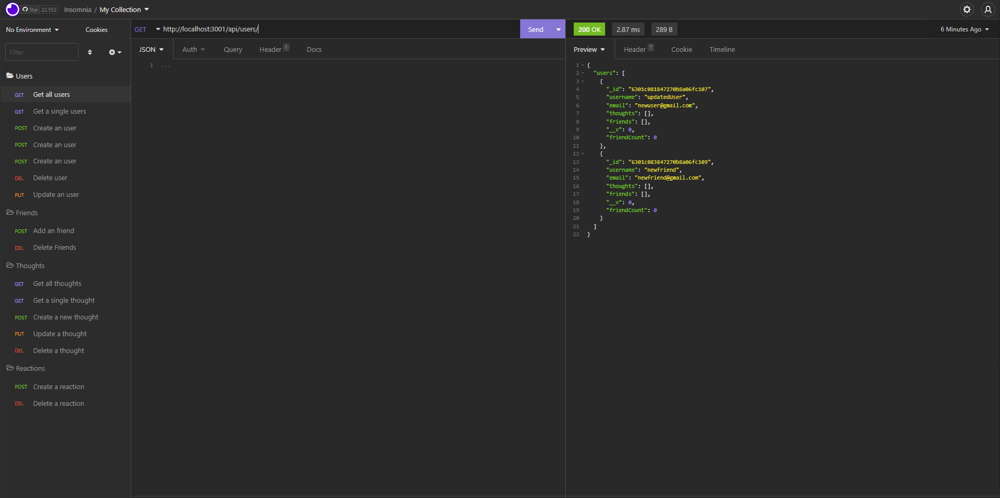

# SocialNetworkAPI
## Link to a walkthrough video
https://drive.google.com/file/d/1UyKMkTU1v5l8300lTpc1cco1cA-38WQx/view

## Description

This repo is for an API which uses a NoSQL database. There are 3 collections: user, thought, and reaction collections. User collection will store user data, such as username, email, thoughts and friends. Thought collection will store text of user thought, data at which thought is created, username and reactions. And reaction will store reaction body, username and date at which reaction is created. And reaction belongs to the thought collection.

## Table of Contents
  - [Installation](#installation)
  - [Usage](#usage)
  - [Contribution Guidelines](#guidelines)
  - [Test Instructions](#test)
  - [License](#license)
  - [Questions](#questions)

## Installation
After cloning this repository, run the command `npm i`.

## Usage
Run this application with a command `npm `. This will connect you to a localhost. And launch your application, such as Postman or Insomnia, to add, update, or delete data to the NoSQL database.

## Contributing
No contribution is needed at the moment.

## Questions
Please feel free to reach out to me at kbjss071@gmail.com.